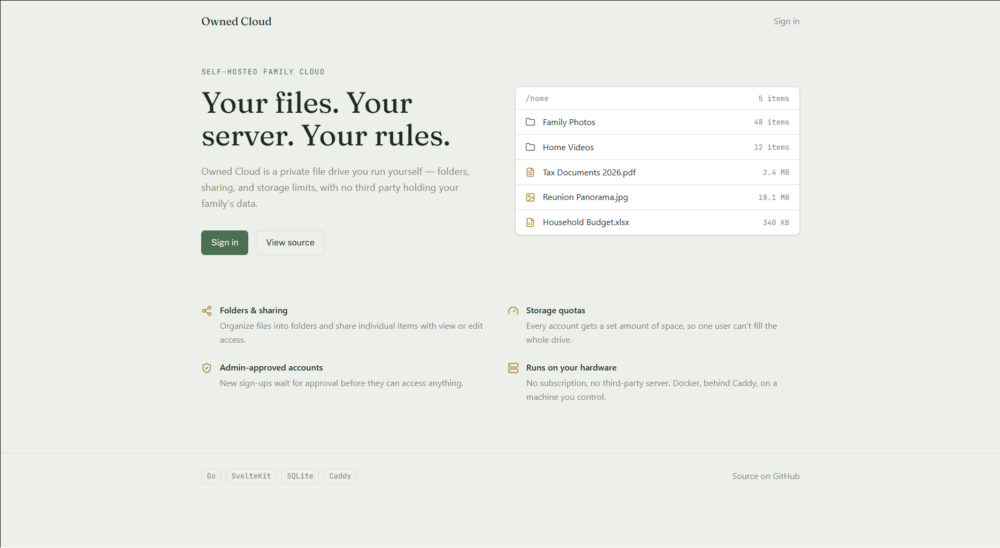

# Owned Cloud

A self-hosted family cloud storage app, built from scratch to learn a new stack, end to end.



## What it is

Owned Cloud is a self-hosted alternative to Dropbox/Google Drive for personal or family use: upload, organize into folders, share with view/edit permissions, and manage storage quotas per user. It runs on your own hardware, no third-party servers involved.

## Why I built it

This project started as a deliberate exercise to learn a new stack: Go, SQLite, and SvelteKit 5, coming from a background in Node/Express/Vue. Rather than following a tutorial, I designed and built the whole thing myself, schema, API, auth, frontend, and deployment, to actually understand the tradeoffs instead of just copying patterns. I kept a day-by-day build log along the way; see [DEVLOG.md](./DEVLOG.md).

## Features

- Email/password authentication with role-based access (admin / user)
- Folder and file management, including drag-and-drop moves
- File sharing with view or edit permissions
- Per-user storage quotas
- Admin panel for user management
- Grid and list views for browsing files

## Tech stack

**Backend**
- Go
- SQLite, with hand-written SQL migrations
- Server-side sessions (bcrypt password hashing, HttpOnly cookies, `crypto/rand` tokens)

**Frontend**
- SvelteKit 5 (runes mode)
- TypeScript
- Tailwind CSS v4
- Self-hosted fonts (Fraunces, Public Sans, JetBrains Mono)

**Infrastructure**
- Docker Compose
- Caddy (reverse proxy + static file server)

## Architecture

The app is deployed as two containers behind a single origin:

- **`backend`** - the Go API, built in three layers: `handlers` (HTTP) → `storage` (SQL) → SQLite. Session-based auth, CORS middleware, and a chunked upload flow (intent + append) for handling large files.
- **`caddy`** - serves the built SvelteKit static assets and reverse-proxies `/api/*` to the backend.

```
Client → Caddy (:80) ─┬─ /api/*  → Go backend (:8080)
                      └─ /*      → static SvelteKit build
```

**Why single-origin?** Serving frontend and API from the same origin lets session cookies stay `HttpOnly` without requiring `SameSite=None; Secure` - which matters for running securely over plain HTTP on a LAN, before HTTPS is layered on via Cloudflare Tunnel.

A few other deliberate design decisions:
- **Explicit root folder row per user** (`root_folder_id` on `Users`) instead of an implicit null-parent root → makes folder queries simpler and more consistent.
- **Sessions over JWT** for v1 → simpler to reason about and revoke; JWT is planned for v2 if/when it's actually needed (e.g. for mobile clients).
- **`FileAccess` over `FileOwnership`** → lets users with Edit-permission shares act on files without conflating access with ownership.

## Getting started

**Prerequisites:** Go, Node.js + [pnpm](https://pnpm.io), Docker (for deployment).

### Local development

```bash
# Backend: copy backend/example.env to backend/.env and fill in admin credentials
cp backend/example.env backend/.env

# Frontend: copy frontend/example.env to frontend/.env and set the API base URL
cp frontend/example.env frontend/.env

# Run both backend and frontend together
./dev.sh
```

This starts the Go backend (`go run .`) and the SvelteKit dev server (`pnpm run dev`) side by side, running both commands one by one in the correct directory will result on the same behavior.

### Deployment (Docker Compose)

```bash
docker compose up -d --build
```

This builds and runs two containers — the Go backend and a Caddy container serving the frontend build while reverse-proxying `/api/*` to the backend — with the backend's SQLite data persisted in a named volume.

## Project status

**v1.0.0** — feature-complete for personal/family use and running in production on my own home server. Current state:

- ✅ Core features working end-to-end (auth, folders, files, sharing, quotas, admin)
- ✅ Deployed to a home server (Docker Compose + Caddy, LAN-first)
- ✅ Automated tests: backend storage + full HTTP integration tests (`go test`), frontend store tests (Vitest)
- ✅ CI/CD: vet, lint (`golangci-lint`), vulnerability scanning (`govulncheck`), build, test, and auto-deploy on merge to `main`
- ✅ Per-IP rate limiting on login/registration
- ✅ Dependabot for Go, npm, Docker, and Actions dependencies
- 🚧 More tools for drive management (bulk actions, search, previews)

**Planned next:**
- HTTPS end-to-end via Cloudflare Tunnel (currently LAN-only over HTTP)
- v2 → JWT auth support, primarily to make a future mobile client viable
- Broader storage-layer test coverage as new features land

## Build log

I've been logging progress since day one, see [DEVLOG.md](./DEVLOG.md) for the day-by-day story, bugs chased, and decisions made along the way.

## License

This project is licensed under the [MIT License](./LICENSE).